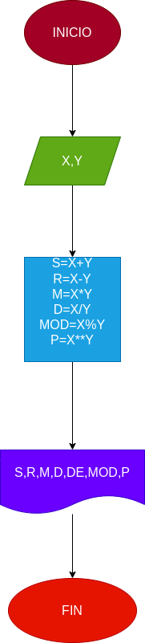

# Ejercicio No.3

## Programa para calcular operaciones aritmeticas

# ANALISIS

Variables de entrada (input)

x:segundo numero

y:segundo numero

variables de proceso y salida (processing,storage,output)

s:La suma de X+Y

R:La resta de X-Y

M:La multiplicacion de X*Y

D:La division de X/Y

DE:La division entera de X//Y

MOD:El modulo de X%Y

P:La potencia de X**Y

# DISEÑO

